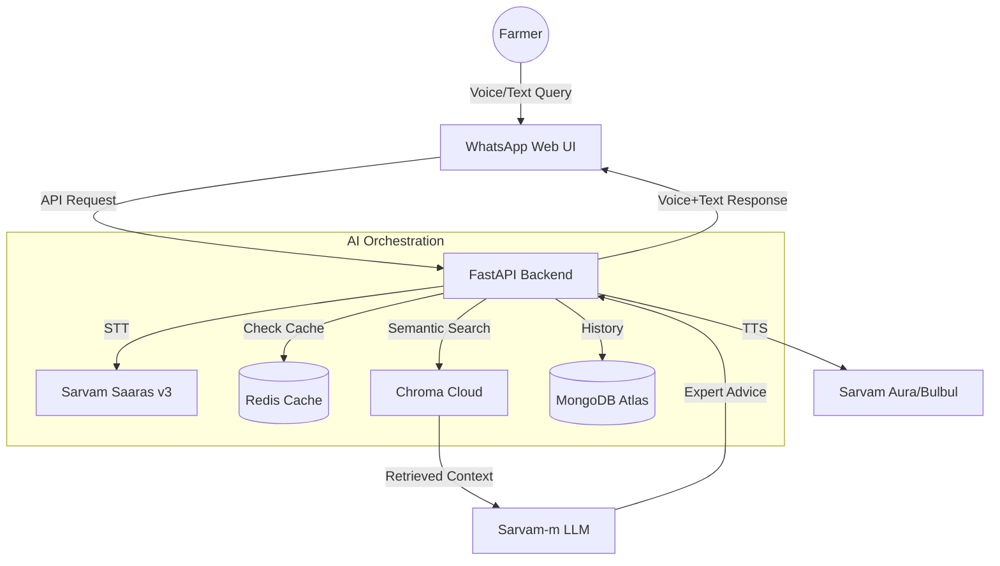

# 🚜 FarmGPT: Next-Generation Multilingual Agricultural Advisor

FarmGPT is a production-grade, AI-powered agricultural advisory platform designed to bridge the gap between complex agricultural science and Indian farmers. Leveraging the **Sarvam AI** ecosystem and a sophisticated **RAG (Retrieval Augmented Generation)** pipeline, FarmGPT provides localized, highly accurate, and conversational advice through an intuitive WhatsApp-style interface.

---

## 🌟 Key Features

### 🎙️ Multilingual Voice-First Interface
- **Voice-to-Voice Pipeline**: Built-in support for multiple Indian languages using Sarvam `Saaras` (STT).
- **On-Demand Neural TTS**: High-fidelity audio generation using `Bulbul` and `Aura` models with regional-specific speakers.
- **WhatsApp UI**: A familiar, sleek interface ensuring zero learning curve for farmers.

### 🧠 Advanced RAG & Deep Diagnosis
- **Verified Knowledge Base**: Integrated 161+ expert documents including technical TNAU data and real-world scenario mappings.
- **Diagnostic Interview Protocol**: FarmGPT acts as a formal specialist, asking 2-3 targeted diagnostic questions before prescribing treatments to ensure accuracy.
- **Zero-Hallucination Policy**: Strictly context-bound responses backed by the official **Chroma Cloud** vector store.

### ⚡ Production Performance Architecture
- **In-Memory Caching**: Redis-powered LLM response caching to maximize speed and minimize API costs.
- **Hybrid Cloud Storage**: 
  - **ChromaDB Cloud**: Semantic High-Dimensional vectors.
  - **MongoDB Atlas**: Persistent chat history and document metadata.
- **Smart Data Cleaners**: Custom-built pipelines to scrape, clean, and flatten raw agricultural data into high-quality search documents.

---

## 🛠️ Technology Stack

| Component | Technology Used |
| :--- | :--- |
| **Backend** | Python, FastAPI, Uvicorn |
| **Frontend** | Pure JavaScript, CSS3 (Modern WhatsApp UI) |
| **AI Models** | Sarvam AI (Saaras v3, Sarvam-m, Bulbul v3, Aura) |
| **Vector DB** | ChromaDB (Managed Cloud) |
| **Database** | MongoDB Atlas (Metadata & Persistence) |
| **Cache** | Redis (Performance Optimization) |
| **Frameworks** | BeautifulSoup4 (Scraping), Sentence-Transformers |

---

## 🗺️ Project Architecture



---

## 🚀 Installation & Setup

### 1. Requirements
Ensure you have Python 3.9+ installed and a valid **Sarvam AI API Key**.

### 2. Environment Configuration
Initialize your `.env` file with the following placeholders:
```bash
SARVAM_API_KEY=your_key_here
MONGO_URI=your_mongodb_uri
REDIS_HOST=localhost
CHROMA_API_KEY=your_chroma_cloud_api_key
```

### 3. Build the Brain (RAG Ingestion)
```powershell
# 1. Scrape latest TNAU data (Optional)
python webscrap.py

# 2. Merge Scenario Mapping + Technical Data
python merge_knowledge.py

# 3. Vectorize to Chroma Cloud
python ingest.py
```

### 4. Launch the Platform
```powershell
python main.py
```
Access the dashboard at: `http://localhost:8000`

---

## 📂 File Map
- `main.py`: Core FastAPI endpoint and UI server.
- `sarvam_api.py`: Orchestrator for all Sarvam AI models (STT, LLM, TTS).
- `prompts.py`: The **Expert Brain** prompt template with strict diagnostic logic.
- `rag.py`: Semantic search engine logic (ChromaDB Integration).
- `db.py`: Connectivity for MongoDB Atlas and Redis caching.
- `merge_knowledge.py`: Converts CSV and JSON into the unified RAG JSON.
- `webscrap.py`: Professional scraper for TNAU Agritech portal.

---

**Developed with ❤️ for Indian Agricultural Innovation**
